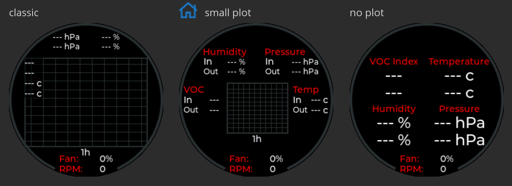

= Nevermore Controller
:toc: macro
:toclevels: 2

https://www.buymeacoffee.com/sanaahamel[image:https://img.shields.io/badge/Support%20This%20Project%20-Buy%20me%20a%20coffee-purple.svg?style=flat-square[Support This Project - Buy me a coffee]] https://discord.gg/hWJWkc9HA7[image:https://img.shields.io/discord/1017933489779245137?color=%235865F2&label=discord&logo=discord&logoColor=white&style=flat-square[Discord]]

A Pi Pico W based controller for the https://github.com/nevermore3d[Nevermore] family of 3D printer filters (including https://github.com/nevermore3d/StealthMax[StealthMax (S)], https://github.com/nevermore3d/Nevermore_Max[Max], and https://github.com/nevermore3d/Nevermore_Mini[Mini] variants).
This controller is BlueTooth LE enabled, minimising required wiring and allowing multiple clients
to interact with the controller.

xref:guide-setup[A setup guide is available.]

xref:doc/wiring.adoc[Wiring diagrams for common setups are available.]

toc::[]

== Features

* [x] xref:klipper[Klipper Module]
* [x] BLE - Multiple Connections Supported
* [x] Fan - Tachometer & xref:fan-control[Automatic Control]
* [x] xref:supported-sensors[Multiple Sensors]
* [x] xref:supported-displays[Custom Display]
* [x] NeoPixel Support

== Required Hardware

*Refer to the BOM from whatever filter you're building. This is just a basic guide for what kind of hardware is needed.*

NOTE: Sensors are available in various sizes, form factors, and pin orders. Check your filter's BOM to see which you should obtain.

.Recommended Hardware
[%autowidth]
|===
| Part      | Name          | Quantity
| MCU       | Pico W        | 1
| Sensor    | VOC           | 2
|           | Temperature   | 2
|           | Humidity      | 2
|===

NOTE: xref:supported-sensors[Many sensor boards are multi-function.] e.g. you'll likely only need one board for temperature/humidity.

The only hard requirement is a Pico W.
Everything else can be omitted at the cost of reduced functionality.

The VOC sensors are critical; they measure the relevant contaminants we wish to filter out.

The temperature & humidity sensors are optional; they serve to improve the accuracy of the VOC sensor. If they're omitted, the system will assume some sensible defaults instead.

NOTE: In the future, you'll be able to use Klipper sensors/thermistors to provide these values. This isn't as precise as dedicated sensors, but it's better than nothing. e.g. You could use the temperature from your toolhead's MCU for the intake temperature.

== Supported Hardware

[#supported-sensors]
.Supported Sensors
[%autowidth]
|===
| Sensor            | Measures                          | Notes
| AHT{10, 20, 21}   | Humidity, Temperature             |
| BMP280            | Temperature, Pressure             | _**Do not use; does not measure humidity.**_
footnote:[Only supported to detect when someone inadvertently uses a BMP280 instead of a BME280.]
| BME280            | Humidity, Temperature, Pressure   |
| BME680, BME688    | Humidity, Temperature, Pressure   | Cannot use gas sensor. footnote:[This specific multi-sensor has a gas sensor, but does not reliably detect VOCs relevant to 3D printing.]
| HTU2xD            | Humidity, Temperature             |
| SGP30             | Volatile Organic Compounds        | Deprecated. footnote:[SGP40s are preferred, but SGP30s should still be functional.]
| SGP40             | Volatile Organic Compounds        |
|===

[#supported-displays]
.Supported Displays
[%autowidth]
|===
| Display   | Description
| GC9A01    | Round, 240px^2
|===

.Supported Miscellaneous Hardware
[%autowidth]
|===
| Name      | Description
| CST816S   | Display Touch Sensor
| NeoPixel  | RGB Bling
|===


[#guide-setup]
== Setup Guide For Dummies

NOTE: Make sure you meet the xref:klipper-requirements[Klipper requirements].

Instructions:

. Build or https://github.com/SanaaHamel/nevermore-controller/releases[download the controller `uf2` binary], flash to Pico W.
+
The Pico W's LED should start flashing once the controller has booted.

. Execute the following to install the Klipper module:
+
```sh
cd ~
git clone https://github.com/SanaaHamel/nevermore-controller
cd nevermore-controller
./install-klipper-module.bash
```

. If you're using Mainsail OS then the install script will ask if you wish to enable BlueTooth.
Do so, and then restart your Klipper host. (e.g. `sudo reboot`)

. Add nevermore your printer config. xref:klipper-config-minimal[Here's a trivial configuration example you can use.]
+
xref:klipper-config-full[See here for complete documentation.]

. Update your printer macros.

.. Add `<<NEVERMORE_PRINT_START>>` to your `print_start` macro.footnote:[I suggest adding gcode rather than a macro wrapper because you want the filter to start when the extruder/bed heats up, and your `print_start` probably does a lot of things (homing, QGL, purge, etc).]
+
```ini
[gcode_macro PRINT_START]
gcode:
    ... <SNIP YOUR CURRENT GCODE> ...

    # Insert right before heating extruder or bed
    # (e.g. M104, M109, M190, ...)

    # See <<NEVERMORE_PRINT_START>> for details and options.
    NEVERMORE_PRINT_START

    ... <SNIP YOUR CURRENT GCODE> ...
```

.. Add `<<NEVERMORE_PRINT_END>>` to your `TURN_OFF_HEATERS` macro.
+
WARNING: This assumes your `print_end` macro calls `TURN_OFF_HEATERS`. If it doesn't then you're doing something weird and potentially dangerous.
+
WARNING: Do *not* put it directly in your `print_end` macro, otherwise it won't trigger on exceptional circumstances (e.g. aborts, errors, cancels).
+
Put this macro wrapper in your config:footnote:[Wherever you'd like.`TURN_OFF_HEATERS` is a built-in macro, and should never be overridden w/o calling the replaced macro, so it doesn't matter if another macro ends up wrapping this wrapper.]
+
```ini
# ASSUME: Your `print_end` macro calls `TURN_OFF_HEATERS`.
[gcode_macro TURN_OFF_HEATERS]
rename_existing: NEVERMORE_CONTROLLER_INNER_TURN_OFF_HEATERS
gcode:
    NEVERMORE_CONTROLLER_INNER_TURN_OFF_HEATERS
    # See <<NEVERMORE_PRINT_END>> for options.
    NEVERMORE_PRINT_END
```

. Check your printer's log file. If everything went well you should see something like:
+
```log
... BLAH
... BLAH
Sending MCU 'mcu' printer configuration...
Configured MCU 'mcu' (283 moves)
... BLAH
... BLAH
[11:27:13:976834] nevermore - discovered controller 28:CD:C1:09:64:8F
[11:27:13:981190] nevermore - connected to controller 28:CD:C1:09:64:8F
... BLAH
... BLAH
```

. If you've flashed a OTA-capable UF2 to your controller (v0.3+) you can update it wirelessly.

. **Calibrate your sensors.** xref:doc/voc.adoc#baseline-calibration[See the calibration section in the VOC Guide.]

[#guide-updating]
== Updating Guide For Dummies

If you've flashed a OTA-capable UF2 to your controller (v0.3+) you can update it wirelessly. The process is simple:
```sh
# switch to your nevermore-controller installation
cd ~/nevermore-controller
# fetch updates for klipper module and tools
git pull
# download & apply latest controller image
./tools/update_ota.py
```

The when you run `update_ota.py` it will install any missing dependencies.
This can take a while the first time, depending on the machine's capabilities.

If you have multiple controllers in range, you can specify which to update using `--bt-address`. e.g. `./tools/update_ota.py --bt-address XX:XX:XX:XX:XX:XX`

See `./tools/update_ota.py --help` for all options.

NOTE: The controller will automatically restart if left idle in bootloader mode for 60 seconds.

Overall, you should see output similar to the following:

```
Tool environment seems up to date.
This program will attempt to update a Nevermore controller.
-------------------------------------------------------------------------

discovering Nevermores...
connecting to XX:XX:XX:XX:XX:XX
current revision: v0.7.0
sending reboot-to-OTA command...
connecting to device...
requesting device info...
sync w/ device...
trying to update bootloader...
requesting device info...
img size: 364544
erasing tail [0x10059000, 0x1005a000]...
updating: 100%|██████████████████████████████████████████████████████████████████████| 356k/356k [00:02<00:00, 129kb/s]
# I've already updated this controller, so nothing changed
update modified 0 of 364544 bytes (0.00%)
updating main image...
requesting device info...
img size: 390912
erasing tail [0x100bb000, 0x10200000]...
updating: 100%|██████████████████████████████████████████████████████████████████████| 384k/384k [00:03<00:00, 120kb/s]
update modified 0 of 393216 bytes (0.00%)
finalising...
rebooting...
update complete.
waiting for device to reboot (1 seconds)...
connecting to XX:XX:XX:XX:XX:XX to get installed version
(this may take longer than usual)
NOTE: Ignore logged exceptions about `A message handler raised an exception: 'org.bluez.Device1'.`
      This is caused by a bug in `bleak` but should be benign for this application.
previous version: v0.7.0  # whatever version was installed
 current version: v0.7.0  # in this example it tried to update to the same version
```

[#usb-console-minicom]
== Getting Console Logs Via USB / UART

If you run into any problems that look hardware related, you can plug the controller via USB or use UART (pins 0, 1) to get logs.
In rare cases USB output might not work, but UART always should. If you have a debug build, this will also work in bootloader mode.

WARNING: When using UART, always connect a shared ground pin between your UART adapter and the Pico _before_ connecting the UART pins. Failure to have a shared 0v can result in hardware damage.

The following assume you're on Linux (you can use your printer's Raspberry Pi) and using USB. Using UART should be identical, just use the UART adapter's serial device instead of the Nevermore directly.

. **If you're using UART instead of USB then connect a shared ground pin before doing anything else.**
See the big note/warning above that you ignored.

. Plug in the controller using a USB cable.
+
The controller should now be visible as a serial device at `/dev/serial/by-id/usb-Raspberry_Pi_Pico_
Nevermore_<device-specific-id>`.

. Open a terminal and run `minicom -c on -b 115200 -D /dev/serial/by-id/usb-Raspberry_Pi_Pico_
Nevermore_<device-specific-id>`.
+
You will probably get a screen that looks like this:
+
```
Welcome to minicom 2.8

OPTIONS: I18n
Port /dev/serial/by-id/usb-Raspberry_Pi_Pico_Nevermore_E6616408432C432E-if00, 15:36:28

Press CTRL-A Z for help on special keys
```

. Restart the controller using one of the following:
.. Use the reset button (if your board has one).
.. Reboot it via `<<NEVERMORE_REBOOT>>` or directly via BLE.
.. Unplug the controller and plug it back in (assuming it is powered by USB only).

. The `minicom` session should now look like this:
```
Welcome to minicom 2.8

OPTIONS: I18n
Port /dev/serial/by-id/usb-Raspberry_Pi_Pico_Nevermore_E6616408432C432E-if00, 15:36:28

Press CTRL-A Z for help on special keys

Checking settings slot #0
corrupt settings: size=0xffffffff not in range [0x0000000c, 0x00001000]
Checking settings slot #1
Checking settings slot #2
corrupt settings: size=0xffffffff not in range [0x0000000c, 0x00001000]
Checking settings slot #3
corrupt settings: size=0xffffffff not in range [0x0000000c, 0x00001000]
Restored settings from slot #1 (CRC: 0x4a1427d1)
DEBUG - SQUARE WAVE pin=10 w/ 30 hz @ 50.00% duty
        div=63.10 top=65487 level=32744
I2C bus 0 running at 399361 baud/s (requested 400000 baud/s)
I2C bus 1 running at 399361 baud/s (requested 400000 baud/s)
SPI bus 0 running at 62500000 baud/s (requested 62500000 baud/s)
[Warn]  (1.017, +1017)   lv_init: Style sanity checks are enabled that uses more RAM    (in lv_obj.c line #181)
BLE GATT - ready; address is 28:CD:C1:0B:7B:63
Waiting 100 ms for sensor init
I2C0 - initializing sensors...
ERR - [I2C0 ***] *** - write failed; len=*** result=-2  # expect lots of these lines
I2C1 - initializing sensors...
ERR - [I2C1 ***] *** - write failed; len=*** result=-2  # expect lots of these lines
...
```

I2C errors during startup are generally normal and expected; that's how the system probes for sensors. If you see `!! No sensors found?`, however, you probably have a problem (unless there are no sensors connected).

When a sensor is found, there will be a line saying so (e.g. `Found SGP30`, or `Found BME280`).

[#faq]
== FAQ / Known Issues

* **The controller's LED is blinking very quickly and I can't connect to it.**
+
The controller is in bootloader mode. If the image isn't corrupted it'll restart in application mode in about 60 seconds if you leave it alone. If it is corrupted, it won't reboot and will stay in bootloader mode to let you upload a valid image using the update tool.

[#faq-is-the-bluetooth-on]
* **The controller is properly flashed (e.g. the LED is blinking) but my Klipper can't connect to it.**
+
There are several possible causes:
+
. Verify sure the Bluetooth is turned on & working.
If you're using Linux, follow the you can use the following to check
+
```
⋊> ~ # ensure BT is on
⋊> ~ bluetoothctl power on
Changing power on succeeded
⋊> ~ # scan to see if we see any BT devices
⋊> ~ bluetoothctl scan on
Discovery started
[CHG] Controller XX:XX:XX:XX:XX:XX Discovering: yes
[NEW] Device XX:XX:XX:XX:XX:XX <censored>
[NEW] Device XX:XX:XX:XX:XX:XX <censored>
^C⏎
```
+
If `bluetoothctl` doesn't work or the scan doesn't list any Bluetooth devices then there's something wrong with your OS's configuration and/or Bluetooth adapter.
You'll need to fix that first (see other FAQ entries for some ideas).
+
. Verify that your Bluetooth adapter can connect to the device. xref:xref:find-the-bt-address-bluetoothctl[If you're on Linux, follow this procedure to find and connect directly to the controller.]
. Verify that *both* your Klipper installation and your controller are the same release version.
+
xref:guide-updating[Easiest way ensure this is to follow the update guide.]
+
If the printer log has exceptions similar to:
+
```
Exception: 4553d138-1d00-4b6f-bc42-955a89cf8c36 (Handle: 67): Unknown doesn't have exactly N characteristic(s) 00002b04-0000-1000-8000-00805f9b34fb with properties ...
```
+
Then you probably have a mismatch between your controller and Klipper module.

+
If you've checked all of the above and you still have exceptions in your printer log then you may go find me on the Nevermore Discord for help.

[#faq-2.4ghz-interference]
* **I'm having trouble getting a reliable connection to the controller. Sometimes it works, sometimes it just doesn't connect.**
+
(This is specifically for the case where your printer log does *not* show any exceptions mentioning bluetooth characteristics; xref:bluez-bad-cache[otherwise see below].)
+
There might be interference on the 2.4 GHz wireless band. If your Klipper host is connected via WiFi make sure it's using 5.0 GHz or try using Ethernet instead.
+
You can test to see if the problem is specific to your Klipper host by xref:find-the-bt-address-nrf-connect[connecting with another machine, such as your pocket supercomputer].
+
This can also happen in environments with absurd number of wireless devices or faulty microwave ovens.

[#bluez-bad-cache]
* **The printer log or nevermore tools show exceptions/errors mentioning missing or unknown 'characteristics' and it can't connect to the controller.**
+
If you encounter an exception or error talking about 'characteristics', such as:
+
```
Exception: <UUID> (Handle: <number>): Unknown has no characteristic <UUID> with properties ...
```
+
Try the following, in order:
+
. xref:guide-updating[Update your controller using OTA.] The controller might be too old for the Klipper module you're using. If you know it's up to date, or can't connect via OTA, continue to 2.
+
. Disable and remove BlueZ GATT caches.
+
BlueZ (Linux's Bluetooth subsystem) has a known bug where it can store corrupt BLE attribute caches. footnote:[Observed in versions up to 5.66.] You can disable and clear this cache to work around this bug:
+
.. ** Disable Caching**
+
Run `sudo nano /etc/bluetooth/main.conf` and in the `[GATT]` section change `#Cache = always` to `Cache = no`. If `main.conf` doesn't have a `[GATT]` section, add it and `Cache = no`. e.g.
+
```ini
[GATT]
Cache = no
```
+
Reboot the machine to apply the change.
.. **Remove Existing Caches**
+
Run `sudo bluetoothctl power off`.
+
Get the addresses of all controllers with `sudo ls /var/lib/bluetooth`. They will be of the form `xx:xx:xx:xx:xx:xx`.
+
Run for each controller `sudo rm -rf /var/lib/bluetooth/<controller-address>/cache`. (Not all controllers will necessarily have a cache.)
+
Reboot the machine to ensure the BlueZ doesn't persist any cache in memory.

[#faq-mainsail-os]
* **I'm using MainsailOS and I'm having trouble with BlueTooth.**
+
This distro disables BlueTooth by default. footnote:[Mainsail OS disabled BlueTooth to enable hardware UART on Raspberry Pi SBCs.] Please follow https://docs-os.mainsail.xyz/faq/enable-bluetooth-on-rpi[this guide] to enable BlueTooth. Alternatively, the install script will attempt to apply the changes for you.
+
Alternatively, you can flash Klipper to the Pico and use it like any other Klipper MCU.
+
NOTE: I intend to improve the experience for people using a wired connection instead of wireless (via the Klipper MCU), but have no concrete timeline.

* **I'm using the xref:klipper-config-minimal[minimal configuration] and I only see the VOC plot entry in Mainsail, there's no 'Nevermore' item.**
+
Verify that your Mainsail version is at least 2.7.1 (first release w/ official support).
If that's fine then double check there isn't any config errors.

[#pin-config-update-bug]
* **Only the intake/exhaust side shows values in Mainsail, the other side only shows `---`.**
+
. Run `./tools/pin-config.py --reset-default`.
+
This fixes a known bug when updating to 0.14+ from older versions that would corrupt the pin config for I2C0 (intake). If this does fix the problem and it was on the exhaust side, then your intake/exhaust I2C lines are swapped.
. Double check your wiring.
+
You can quickly test this by swapping your working side's sensors with the problematic one.
If problematic side starts working then the issue is with the sensors you pulled, otherwise the wiring is the problem.

* **Fluidd doesn't show sensor values other than temperature, even with the `class_name_override` hack.**
+
Fluidd is partially supported with regards to sensor display and visualisation.
It requires using `temperature_sensor` with `NevermoreSensor` to display state;
it does not have an equivalent to Mainsail's dedicated display.

== Display Support

There are a handful of UIs available. You can select them using the xref:klipper-config-full[`display_ui` klipper option].

.Supported Display UIs


=== Touch Support
Touch display support is early in development and currently very limited.
For now you can:

* Long press on the center area to toggle the fan override on/off
* Press/drag on the fan power ring to set the fan override to a specific percent

== Software Build Requirements

* Pico-W SDK 1.5.1+
* CMake 3.20+
* C++23 compiler, e.g. GCC 12+ (tested w/ 12.2.1)

== Controller Customisation

`src/config.hpp` contains all user-customisable options.
These options are, for the most part, validated at compile time to prevent mistakes.


=== Pin Assignments

Pins assignments can be customised, but are subject to hardware-related constraints. These are constraints are extensively checked at compile time and runtime, and will result in a (hopefully) useful error message if violated. If it compiles, it's a valid configuration.


==== Custom Assignments

The recommended way to customise pin assignments is to use the `pin-config.py` tool:
```sh
# update the pin configuration. follow the on-screen instructions.
~/nevermore-controller/tools/pin-config.py
```

Changes will only take effect after a reboot of the controller.

You can reset the configuration to the board defaults using `--reset-default`.
See `--help` for more options.


==== Default Assignments

WARNING: GPIO 0 and 1 are currently hardcoded for UART. They cannot be used in any pin assignments.

WARNING: The default assignments are tentative and will probably change after we get some feedback as to which layouts work best in practice.

[#default-pin-table-pico-w]
.Default Pin Assignments - Pico W
[%autowidth]
|===
|GPIO | Function
|0  | UART - TX
|1  | UART - RX
|2  | Display - GC9A01 - SPI SCK
|3  | Display - GC9A01 - SPI TX
|4  | Display - GC9A01 - SPI RX (not used, for future hardware)
|5  | Display - GC9A01 - Command
|6  | Display - GC9A01 - Reset
|7  | Display - Backlight Brightness PWM
|8  | Display Touch - CST816S - Interrupt
|9  | Display Touch - CST816S - Reset
|10 | Photocatalytic Control (PWM)
|12 | NeoPixel - Data
|13 | Fan - PWM
|15 | Fan - Tachometer
|18 | Exhaust - I2C SDA
|19 | Exhaust - I2C SCL
|20 | Intake - I2C SDA
|21 | Intake - I2C SCL
|===

[#default-pin-table-waveshare-touch-lcd-1.28]
.Default Pin Assignments - Waveshare Touch LCD 1.28"
[%autowidth]
|===
|GPIO | Function
|16   | Intake - I2C SDA
|17   | Intake - I2C SCL
|26   | NeoPixel - Data
|27   | Fan - Tachometer
|28   | Fan - PWM
|===


[#persistence]
== Persistent Settings

The controller will save most settings and calibrations to built-in flash
periodically.
To minimise wear & tear, settings are written every 10 minutes (if they've changed),
and sensor calibrations are checkpointed every 24h.
Settings are also immediately written (if changed) before any reboot requests.

The current implementation doesn't distinguish between user customised values
and default ones. Consequently, if default settings change they won't be updated
automatically unless your settings are reset.
This can be done using xref:NEVERMORE_RESET[`NEVERMORE_RESET`], if you are connected via Klipper.


[#klipper]
== Klipper

[#klipper-requirements]
=== Requirements

* xref:faq-is-the-bluetooth-on[Working BlueTooth on your Klipper host.]
* Klipper using Python 3.7+
* KIAUH-like installation (required by installation script)

TL;DR: If you installed everything using https://github.com/th33xitus/kiauh[KIAUH], you should be good to go so long as you installed Klipper with Python 3.

=== Configuration

[#klipper-config-minimal]
==== Minimal Example

This example configuration is intended for quickly getting up and running. You can just copy paste this into your printer's config.

Check out the full documentation section (just after this) after you've tested everything works with the minimal configuration; there are many useful options for customisation.

```ini
[nevermore]
# BOM specifies a 16 pixel ring.
# If you don't have LEDs, you can omit the two `led_*` lines entirely
led_colour_order: GBR
led_chain_count: 16
# These `fan_power_*` entries are for a DELTA BFB0712HF (StealthMax BOM)
# If you have a different fan then play with these numbers to your satisfaction.
# See full config documentation for details.
fan_power_coefficient: 0.7  # lower max power to keep things much more quiet

# Optional
# This 'temperature' sensor only serves to draw the intake VOC index on
# Mainsail's temperature plot.
[temperature_sensor nevermore_intake_VOC]
sensor_type: NevermoreSensor
sensor_kind: intake
plot_voc: true

# Uncomment the following if you're using Fluidd as your main UI.
# [temperature_sensor nevermore_intake]
# sensor_type: NevermoreSensor
# sensor_kind: intake
# [temperature_sensor nevermore_exhaust]
# sensor_type: NevermoreSensor
# sensor_kind: exhaust
```


==== WS2812 Example (NeoPixel)

WS2812 pixel strips can be used just like any other WS2812 pixel strip connected to your Klipper instance. https://github.com/julianschill/klipper-led_effect/blob/master/docs/LED_Effect.md[This includes support for LED effects.]
See xref:klipper-object-naming[Klipper Object Naming] if you have a non-default named Nevermore.

```ini
# led-effects are supported, here's an example:
[led_effect panel_idle]
autostart:              true
frame_rate:             24
leds:
    nevermore
layers:
    comet  1 0.5 add (0.0, 0.0, 0.0),(1.0, 0.0, 0.0),(1.0, 1.0, 0.0),(1.0, 1.0, 1.0)
    breathing  2 1 top (0,.25,0)
```


[#klipper-config-full]
==== Full Documentation

WARNING: Don't copy-paste this into your config/ It won't give you a working setup. xref:guide-setup[Follow the setup guide if you have any doubts.]

This section lists all options and defaults. Some minor examples are also provided.

NOTE: The values shown here are either the default for that option or a placeholder.

NOTE: If you don't care about a setting, leave it unset. Suggested defaults will change over time based on user feedback.

```ini
# DON'T JUST COPY PASTE THIS INTO YOUR CONFIG.
# READ THE SETUP GUIDE.

# If name is omitted, will default to just `nevermore`
[nevermore nevermore]
# Can omit if you have only one nevermore in range.
# See <<Finding The BT Address>> for more info.
# NOTE: Providing an address will make startup slightly faster.
#       (If no address is provided then the system must spend extra time
#        verifying that there's only one nearby Nevermore.)
# example - `bt_address: 43:43:A2:12:1F:AC`
bt_address: <optional, omitted by default>

# seconds, 0 to disable, how long to wait before reporting that the Nevermore is missing.
# If disabled (set to 0) the module will keep trying to connect in the background.
# Disabling this requires that `bt_address` is set.
#
# WARNING:  Do not disable unless you've already tested that it can connect to the Nevermore.
# WARNING:  If you set this < 10 you will likely have trouble connecting to the Nevermore.
# NOTE:     The module quietly keeps trying to reconnect if connection is lost after startup.
# NOTE:     It takes some amount of time to reliably scan & connect to Nevermore.
#           This varies on a few factors outside of your control, so the system
#           will reject unfeasibly small timeout values to keep you from screwing
#           yourself over.
connection_initial_timeout: <default varies based on whether `bt_address` is set>

# LED
# For the optional LED ring feature.
# Members generally behaves like the WS2812 klipper module.
# (e.g. supports heterogenous pixel chains)
led_colour_order: GRB
led_chain_count: 0

# Fan Options
# Various settings for the fan.

# float \in [0, 1] - Fan power used when the automatic policy nor overridden
fan_power_passive: 0

# float \in [0, 1] - Fan power used when the automatic fan policy is active.
fan_power_automatic: 1

# float \in [0, 1] - Coefficient applied to the fan power.
# i.e. Limits the maximum speed of the fan. Useful for things like managing noise.
# e.g. At 0.75, requesting 100% power will run the fan at 75% power.
fan_power_coefficient: 1


# Fan Policy
# Controls how/when the fan turns on automatically.

# seconds, how long to keep filtering after the policy would otherwise stop
fan_policy_cooldown: 900
# voc index, 0 to disable, filter if any sensor meets this threshold
# NB: if < 200 then fan will engage when in the 'nominal' region (see VOC guide)
fan_policy_voc_passive_max: 200
# voc index, 0 to disable, filter if the intake exceeds exhaust by at least this much
fan_policy_voc_improve_min: 25

# Fan Policy - Thermal Limit
# Controls how/when the fan power is throttled down if the temperature is too high.
# See Fan Control section for details.

# float, Celsius, temperature at which point thermal limiting starts being applied
fan_thermal_limit_temperature_min: 50
# float, Celsius, temperature at which point thermal limiting is fully applied
fan_thermal_limit_temperature_max: 60
# float \in [0, 1], 1 to disable the thermal limiter
# 0 to disable the fan at max temp
# 0.5 to half the fan speed at max temp
# 1 to effectively disable the thermal limiter (no scaling at max temp)
fan_thermal_limit_coefficient: 0


# Sensor Settings

# voc index \in [175, 500], threshold where the system stops adjusting the
# calibration because the air is "unusually dirty". (AKA 'gating')
# VOC emissions can significantly vary between different filament materials and
# brands.
# Set this threshold to the 'typical' VOC index observed mid print.
# Setting this *too* low will prevent the system from adjusting to normal
# air quality variations.
# If you print with multiple materials/brands, see the G-Code command
# `NEVERMORE_VOC_GATING_THRESHOLD_OVERRIDE`.
# (or as close as possible given the minimum)
# voc index \in [175, 500]
voc_gating_threshold: 240


# Display Options

# float \in [0, 1] - display backlight PWM %
display_brightness: 1

# enum - display UI
# Valid enums:
#   GC9A01_CLASSIC      - full sized VOC plot
#   GC9A01_SMALL_PLOT   - smaller plot w/ explicit labels
#   GC9A01_NO_PLOT      - no plot, largest text size
#
# NB: Changing will take effect when the controller reboots.
#     You can reboot the controller using `NEVERMORE_REBOOT`. See G-Code Commands section.
display_ui: GC9A01_CLASSIC


# Vent Servo
# NOTE: To reverse direction set `vent_servo_pulse_width_max` < `vent_servo_pulse_width_min`

# seconds \in (0, 0.02), duration of pulse when requested 0%
#vent_servo_pulse_width_min: 0.001
# seconds \in (0, 0.02), duration of pulse when requesting 100%
#vent_servo_pulse_width_max: 0.002


# Misc. Sensor Options

# If temperature, humidity, etc, is unavailable on one side of the filter then
# report the value from the other side (if available).
# Useful for builds where you only have one temperature or humidity sensor,
# and you want to use it for both intake/exhaust.
sensors_fallback: false

# Use the MCU's temperature as an exhaust temperature fallback.
# Only useful for filters which have the MCU in the exhaust airflow (e.g. StealthMax)
# and don't have any dedicated temperature sensors.
sensors_fallback_exhaust_mcu: false


# MOSTLY OBSOLETE.
# Mainsail 2.7.1 introduced dedicated support for Nevermore controllers, simply having
# `[nevermore]` is sufficient to display sensor values in the 'Temperatures' panel.
#
# Only remaining useful behaviour for `temperature_sensors` is the `plot_voc` option
# which allows drawing the VOC index values for intake/exhaust in the temperature plot.
[temperature_sensor <name>]
sensor_type: NevermoreSensor # fixed, must be `NevermoreSensor`

# valid values: `intake`, `exhaust`
sensor_kind: <required, no defaults>

# full Klipper object name of the Nevermore instance to use as a source
nevermore: nevermore

# Mainsail 2.7.1 doesn't recognise `NevermoreSensor` as sensor it should plot.
# This hacky option allows overriding the class name with one it does recognise
# as something that should be plotted.
# Using `bme280` is strongly suggested.
class_name_override: <optional, not set by default>

# Pretends the VOC index is a temperature, allowing it to be plotted in Mainsail/Fluidd.
# Setting this to `true` will suppress the all other readings for this sensor object.
# (e.g. temperature, pressure, etc)
plot_voc: false

```


[#klipper-object-naming]
=== Klipper Object Naming

Nevermore instances have two kinds of names:
* Short names: Used by GCode commands (i.e. `NEVERMORE=<short name>`).
* Full Klipper names: Used by the Klipper config files.

NOTE: Full Klipper full names are case and whitespace sensitive.

.Nevermore Object Names
[%autowidth]
|===
|Klipper Config Declaration | Short Name    | Full Klipper Name   | LED Effect Name
|`[nevermore]`              | `nevermore`   | `nevermore`         | `nevermore`
|`[nevermore Foo_Bar]`      | `Foo_Bar`     | `nevermore Foo_Bar` | `nevermore:Foo_Bar`
|===

When referring to a Nevermore for LED effects, use the full klipper name and replace any spaces with `:`.


[#klipper-gcode-commands]
=== G-Code Commands

The following command can be used to influence behaviour at runtime.

These typically require a `NEVERMORE=` parameter to specify which Nevermore to interact with.
At this time, there can only be one Nevermore controller, which is named `nevermore`.


==== NEVERMORE_PRINT_START

Command:
```
NEVERMORE_PRINT_START [NEVERMORE=<name>] [FAN_SPEED=1.0 <float \in [0, 1]>] [FAN_AUTOMATIC=0 <int \in [0, 1]>]
```

Set Nevermores into a reasonable state for printing. **You should use this G-Code command instead of manually issuing the equivalent commands**; it will allow future updates to automatically apply recommended print-start actions. Applies to all Nevermores unless a specific one is named using`NEVERMORE=`.

This command currently performs the following series of actions for every Nevermore (currently only 1):

* If `FAN_AUTOMATIC=0`, turns on fan override w/ given `FAN_SPEED`, otherwise clears any override (go into automatic mode).
+
Overriding automatic mode starts the filter without waiting for the air to get detectably dirty and ensures the fan is always running during a print (regardless of sensor readings).
* Disables <<NEVERMORE_VOC_CALIBRATION>>.


==== NEVERMORE_PRINT_END

Command:
```
NEVERMORE_PRINT_END [NEVERMORE=<name>]
```

Set Nevermores into a reasonable idle state. **You should use this G-Code command instead of manually issuing the equivalent commands**; it will allow future updates to automatically apply recommended print-end actions. Applies to all Nevermores unless a specific one is named using`NEVERMORE=`.

This command currently performs the following series of actions for every Nevermore (currently only 1):

* Disables fan override.
* Enables <<NEVERMORE_VOC_CALIBRATION>>.


==== NEVERMORE_VENT_SERVO_SET

Command:
```
NEVERMORE_VENT_SERVO_SET [NEVERMORE=<name>] [PERCENT=<float \in [0, 1]>]
```

Set the vent's servo pulse to the specified % between . Omitting `PERCENT` disables the servo.


==== NEVERMORE_STATUS

Command:
```
NEVERMORE_STATUS [NEVERMORE=<name>]
```

Prints the Nevermores' current status to the console.
Lists all Nevermores unless a specific one is named using`NEVERMORE=`.
Not terribly useful for most things, but helpful if you're not sure it's connected
yet. (e.g. when used with `connection_initial_timeout: 0`)

==== NEVERMORE_REBOOT

Command:
```
NEVERMORE_REBOOT [NEVERMORE=<name>]
```

Reboots Nevermores, if connected. Persistent settings will be saved.
Applies to all Nevermores unless a specific one is named using`NEVERMORE=`.

Probably easier than power cycling your whole printer.


==== NEVERMORE_RESET

WARNING: *This command should not be used unless directed by Someone Who Knows What They're Doing.*

Command:
```
NEVERMORE_RESET FLAGS=<int> [NEVERMORE=<name>]
```

Resets persistent settings to defaults.
It is deliberately under-documented to dissuade causal use.
Applies to all Nevermores unless a specific one is named using`NEVERMORE=`.

Policy settings can can be reset to default using `FLAGS=2`.


==== NEVERMORE_VOC_CALIBRATION

Command:
```
NEVERMORE_VOC_CALIBRATION ENABLED={0, 1} [NEVERMORE=<name>]
```

Enables/disables the VOC sensor calibration.
*Sensor calibration should be enabled whenever the printer isn't printing.*
Applies to all Nevermores unless a specific one is named using`NEVERMORE=`.

Sensor calibration should *only* be disabled when the printer is printing. Doing
this prevents the VOC sensor from mistaking low VOC emissions for sensor drift
and implicitly compensating for it.

This should be used in conjunction with `NEVERMORE_VOC_GATING_THRESHOLD_OVERRIDE`
to automatically enable/disable VOC calibration if the air is still dirty post-print.

VOC sensor calibration is always enabled when the controller powers on.


==== NEVERMORE_VOC_GATING_THRESHOLD_OVERRIDE

Command:
```
NEVERMORE_VOC_GATING_THRESHOLD_OVERRIDE [NEVERMORE=<name>] [THRESHOLD=<int \in [175, 500]>]
```

Overrides the VOC gating threshold (see `voc_gating_threshold` in the klipper config). Omit the `THRESHOLD` parameter to clear any existing override.
Applies to all Nevermores unless a specific one is named using`NEVERMORE=`.

This is intended for setups where the slicer specifies the filament type using a user-defined G-Code macro (e.g. `SET_MATERIAL ABS`), and you would like to temporarily set the VOC gating threshold for a specific material/filament.

Unlike the `voc_gating_threshold`, this is setting is *not* persisted and will be lost when the controller restarts.


==== NEVERMORE_SENSOR_CALIBRATION_CHECKPOINT

Command:
```
NEVERMORE_SENSOR_CALIBRATION_CHECKPOINT [NEVERMORE=<name>]
```

Force sensors to checkpoint their calibration.
The checkpoints will be persisted after a brief delay (under 20 seconds).
Applies to all Nevermores unless a specific one is named using`NEVERMORE=`.

Useful if you must save the current calibration immediately instead of waiting
for the usual 24h periodic checkpoint.
e.g. xref:doc/voc.adoc#baseline-calibration[After a short baseline calibration.]


==== NEVERMORE_SENSOR_CALIBRATION_RESET

Command:
```
NEVERMORE_SENSOR_CALIBRATION_RESET [NEVERMORE=<name>]
```

Resets the sensor calibrations. Does not immediately persist this reset calibration, but it will eventually be applied when the checkpoint process triggers.
Applies to all Nevermores unless a specific one is named using`NEVERMORE=`.

Useful when moving the printer to a new environment.


=== Finding The BT Address

**If you have only one Nevermore controller in range then you can omit the `bt_address` option in your printer configuration and ignore this section entirely.**

If you have multiple BlueTooth (BT) devices in range that look like candidates for a Nevermore controller, then you have to specify which one to use. This is done by specifying their 'address' in the printer config using `bt_address: <address>`.

On Linux and Windows hosts, this address looks like `XX:XX:XX:XX:XX:XX`, where `X` is a hexadecimal digit.

On MacOS hosts, this address is a randomly assigned UUID specific to that host.

NOTE: It is possible, but very rare, for the address to change when a new `uf2` is flashed onto the Pico. This has been observed once after updating the Pico SDK.

==== Method A - Check the Klipper Log

An error will be raised if there are multiple controllers in range.
The error message will list all the available controllers' addresses.

Pick one from the list and stuff that into the `nevermore` section's `bt_address`.

For example, given this log:

```log
...
...
[11:06:36:535560] nevermore - multiple nevermore controllers discovered.
specify which to use by setting `bt_address: <insert-address-here>` in your klipper config.
discovered controllers (ordered by signal strength):
    address           | signal strength
    -----------------------------------
    FA:KE:AD:RE:SS:01 | -38 dBm
    FA:KE:AD:RE:SS:00 | -57 dBm
Config error
Traceback (most recent call last):
  File "~/klipper/klippy/klippy.py", line 180, in _connect
    cb()
  File "~/klipper/klippy/extras/nevermore.py", line 793, in _handle_connect
    raise self.printer.config_error("nevermore failed to connect - timed out")
configparser.Error: nevermore failed to connect - timed out
...
...
```

We could use `bt_address: FA:KE:AD:RE:SS:01` or `bt_address: FA:KE:AD:RE:SS:00`.

In this case I'd plug in `FA:KE:AD:RE:SS:01` since that device has the strongest signal, i.e. closest-ish to the Klipper host.

[#find-the-bt-address-bluetoothctl]
==== Method B - Linux Only - `bluetoothctl`

NOTE: Only works on Linux. Yes, I know you didn't read the title.

. Make sure your Nevermore controller is powered and the LED is blinking. (Indicates it is active.)

. In a terminal, run: `bluetoothctl`
+
This'll open a REPL interface.
+
```
⋊> ~ bluetoothctl
Agent registered
[CHG] Controller FA-KE-AD-RE-SS-FF Pairable: yes
[bluetooth]#
```

. Run: `scan on`, **wait a few seconds** (~5 or 6 is plenty)
+
Starts background scan for devices.
This isn't a blocking command, you can issue other commands as it scans in the background.
+
```
[bluetooth]# scan on
Discovery started
[CHG] Controller FA-KE-AD-RE-SS-FF Discovering: yes
[NEW] Device FA:KE:AD:RE:SS:05 <censored>
[NEW] Device FA:KE:AD:RE:SS:00 Nevermore
[CHG] Device FA:KE:AD:RE:SS:05 RSSI: -53
[CHG] Device FA:KE:AD:RE:SS:04 ManufacturerData Key: 0x004c
...
[DEL] Device FA:KE:AD:RE:SS:04 FA-KE-AD-RE-SS-04
[NEW] Device FA:KE:AD:RE:SS:04 FA-KE-AD-RE-SS-04
...
```
+
WARNING: If you wait too long (~15-20 seconds), the scan ends, and the host will forget about the devices it discovered.

. Run: `devices`
+
```
[bluetooth]# devices
Device FA:KE:AD:RE:SS:05 <censored>
Device FA:KE:AD:RE:SS:01 Nevermore
Device FA:KE:AD:RE:SS:04 FA-KE-AD-RE-SS-04
Device FA:KE:AD:RE:SS:00 Nevermore
Device FA:KE:AD:RE:SS:02 FA-KE-AD-RE-SS-02
Device FA:KE:AD:RE:SS:03 FA-KE-AD-RE-SS-03
```
+
Look for the entries named "Nevermore", "Nevermore Controller", or "picowota" footnote:[This is the name it uses when in bootloader mode. Unfortunately BlueZ is too aggressive about caching device names.], and copy their address into the printer configuration.
+
In this example, we could use `bt_address: FA:KE:AD:RE:SS:00` or `bt_address: FA:KE:AD:RE:SS:01`.

. You should try connecting to the controller to verify that there's no significant interference:
+
Run: `connect <BT address>`
+
```
[bluetooth]# connect FA:KE:AD:RE:SS:00
Attempting to connect to FA:KE:AD:RE:SS:00
[CHG] Device FA:KE:AD:RE:SS:00 Connected: yes
Connection successful
<lots of of new services/characteristics announced>
```
+
If connecting fails, or momentarily succeeds and then connection is lost, then there might be interference from your WiFi adapter. xref:faq-2.4ghz-interference[See this FAQ for details.]


[#find-the-bt-address-nrf-connect]
==== Method C - Use Your Phone + nRF Connect

WARNING: If you're hosting Klipper on MacOS then you cannot use this approach and must use <<Method A - Check the Klipper Log>>.

nRF Connect is an app by Nordic Semi.
It's meant for debugging/exploring BLE devices, but we can (ab)use to find the BT addresses.

Load the app, scan for BLE devices. The controllers will all be named "Nevermore" (or "picowota", if in bootloader more), and their BT addresses will be listed below.

.nRF Connect displays device names & addresses
image::doc/README-nrf-connect.png[nRC Connect Screenshot,256]

You can test if your controller is accepting new connections by pressing the 'connect' button.


[#fan-control]
=== Fan Control & Macros

There are two modes of operation:

* Automatic - Fan power is managed by the controller based on its fan policy (xref:klipper-config-full[see here]).

* Manual - Fan power is overridden and will run at the specified power until the override is cleared.

In both cases, the fan power is scaled by two factors:

* The `fan_power_coefficient` setting scales in all cases. Useful for limiting noise since the StealthMax recommended fans are more powerful than strictly needed.

* Thermal Limiting scales the actual fan power applied based on the maximum of the intake and exhaust temperatures. This is intended to improve the carbon's effective lifespan, which degrades at high temperatures. This feature can be disabled by setting xref:klipper-config-full[`fan_thermal_limit_coefficient: 1`].


From within Klipper, the fan can be controlled much like any other fan:

```gcode
; override automatic fan control, full speed ahead
SET_FAN_SPEED FAN=nevermore_fan SPEED=1
; not specifying `SPEED=` disables fan override and returns to automatic fan control
SET_FAN_SPEED FAN=nevermore_fan
```

WARNING: Setting the fan speed to 0 in Mainsail/Fluidd UI does **not** clear the control override. It just sets it to zero. (i.e. disables the fan)

If you would like to limit the maximum speed of the fan, e.g. to reduce noise, xref:klipper-config-full[set `fan_power_coefficient` to a value < 1].

== Credits

* https://github.com/julianschill/klipper-led_effect[Julian Schill] - installation script (derived)
* https://github.com/boschsensortec/BME280_driver[Bosch Sensors] - BMP280, BME280, BME68x library (included)
* https://github.com/sciosense/ENS160_driver[ScioSense] - ENS160 library (referenced)
* https://github.com/Sensirion/embedded-sgp[Sensirion] - SGP30 library (referenced)
* https://github.com/Sensirion/gas-index-algorithm[Sensirion] - SGP40 gas index library (included)
* https://github.com/klipper3d/klipper[Klipper] - AHTxx library (referenced)
* https://github.com/apache/nuttx[Apache Nuttx] - I2C software reset (derived)
* https://github.com/0ndsk4[0ndsk4] - Donated hardware for testing
* Gary S. Brown - CRC32 table (included)
* Drevic (Nevermore Discord) - SGP30 Testing Volunteer
