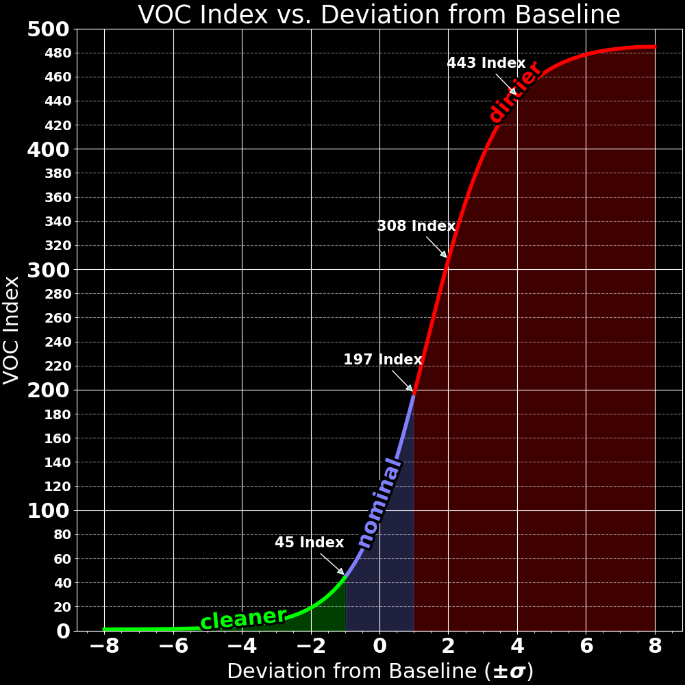
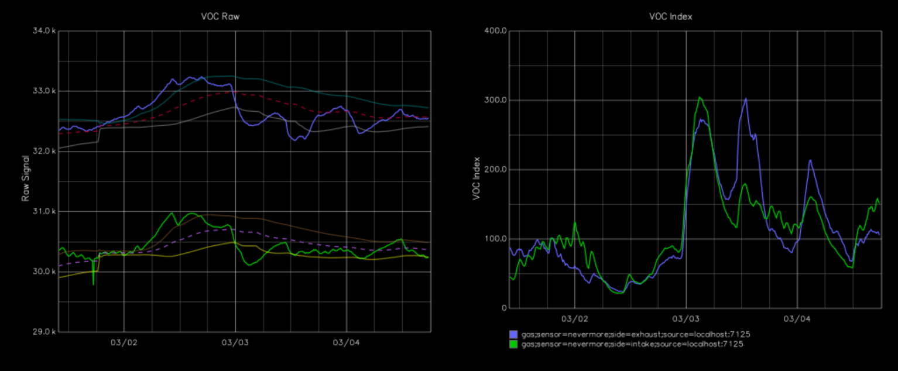

= A Raccoon's Guide to Smelly Things - VOC Sensors & Index
:toc: macro
:toclevels: 2

https://www.buymeacoffee.com/sanaahamel[image:https://img.shields.io/badge/Support%20This%20Project%20-Buy%20me%20a%20coffee-purple.svg?style=flat-square[Support This Project - Buy me a coffee]] https://discord.gg/hWJWkc9HA7[image:https://img.shields.io/discord/1017933489779245137?color=%235865F2&label=discord&logo=discord&logoColor=white&style=flat-square[Discord]]

Everything you wanted to know about Volatile Organic Compounds (VOCs), indices, and sensors, but were afraid to ask.

NOTE: If you don't read this and ask a question answered here on the Discord, you are morally required to donate to the nearest raccoon sanctuary/rehab.

toc::[]

== What are Volatile Organic Compounds?

[quote,https://en.wikipedia.org/wiki/Volatile_organic_compound]
Volatile organic compounds (VOCs) are organic compounds that have a high vapor pressure at room temperature.

tl;dr: They stink, give you headaches and maybe cancer too. footnote:[Realistically all the other endocrine disruptors, PFAS, and microplastics in your life will get you first.]

VOCs are a diverse class of compounds. Heating most plastics (e.g. 3d filament) releases VOCs. An in depth analysis of what VOCs are released by 3D printing filaments can be found find in https://sci-hub.se/https://doi.org/10.1016/j.buildenv.2019.106209["Characterization of volatile organic compound emissions from consumer level material extrusion 3D printers" (Davis et al, 2019)]. For our purposes it's sufficient to know that the mixture and quantity of VOCs varies considerably between brands of filaments, depending on what materials and additives are present in the filament. i.e. one brand of filament might off gas more than an other.

Not all VOCs are perceptible by humans, but enough are that a sniff test is a reasonable quick & dirty test.

== VOC Index

For air filters, we are interested primarily in answering the question: is the air getting 'dirtier' or 'cleaner'? This idea is captured using the "VOC Index". Succinctly:

* It is a **relative measure** of how much more dirty/clean the air is **relative to a learned baseline**.
* It ranges from [0, 500], where 100 is the learned baseline.
* Values < 100 are 'cleaner' than the baseline.
* Values > 100 are 'dirtier' than the baseline.
* It is **non-linear** and **non-symmetric**. See below.
* **It is specific to each sensor and should not be compared between sensors.** footnote:[
You cannot compare VOC index values from different sensors because each sensor learns its own individual baseline and the index is relative to that sensor's baseline.]

The following plot illustrates how the index corresponds to deviations from the learned baseline:

[[voc-index-vs-stddev]]
.VOC Index vs. Std Deviations from Baseline

=== Baseline

Each sensor independently establishes a baseline. **This baseline is expected raw response of the sensor over the last 24 hours, along with expected noise/ambient variation.**

If there is no saved baseline available then the controller will quickly adjust the baseline to match current conditions during the first 4 hours of operation. After that initial period, the baseline is slowly adjusted to match current conditions unless current conditions are significantly dirtier than the baseline. (See `voc_gating_threshold` in the xref:../README.adoc#klipper-config-full[main documentation].)

This learning behaviour is shown in <<voc-raw-signal-baseline>>, where two SGP40s are placed an idle enclosed printer for a period of 80 hours. The green/blue line are the intake/exhaust values, the dashed lines represent the learned baseline mean, and the other faint lines represent the learned expected variation bounds. (Note that the sensors were reset early on, hence the sudden constriction in the variance bounds.)

Of note:

* The two plots have an inverse relationship: lower resistance (raw signal) signals greater contamination (VOC Index).

* The variation bounds shown here correspond to the nominal range in <<voc-index-vs-stddev>>.

* The two sensors have different baselines despite both being SGP40s in the same general environment. This is expected, see <<VOC Sensors>>.

[[voc-raw-signal-baseline]]
.VOC Raw Sensor Response Over Time

== VOC Sensors

Cheap consumer grade VOC sensors make a number of compromises:

* They generally cannot distinguish between different gases or VOCs.
* Their sensitivity varies between gases/VOCs.
* Their response can drift slightly over time.
* Their response can vary between devices.
* Their response is temperature dependent.
* They are *very* sensitive to water vapor (humidity).

The degree of all of these varies between different models but generally applies to all consumer grade VOC sensors. Some of these considerations can be compensated for. (e.g. temperature and humidity.)

[#baseline-calibration]
=== Baseline Calibration

NOTE: The printer cannot be used during calibration.

Baseline calibration consists of letting the system learn a <<Baseline>> corresponding to 'clean air', where 'clean air' means as clean as the air in the room. This will take 8+ hours minimum and ideally 24.

WARNING: The controller saves the current baseline to flash every 24 hours. If you power down before 24 hours have passed then the current calibration will not be saved.

. Cool down the printer.

. Disable the fan by setting the fan override to 0.
+
e.g. `SET_FAN_SPEED FAN=nevermore_fan SPEED=0`

. Open the printer door/enclosure.

. *[Optional]* Remove the carbon basket (if applicable).
+
This helps ensure both intake/exhaust sensors are exposed to the same air and reach similar calibrations. You can leave the basket on the printer bed during calibration.

. Let some fresh air into the room for a minute or two.
+
Open a window for a few minutes, flap a hand towel in the doorway, whatever. The objective is to get clean air into the enclosure. **This air will serve as reference for the baseline.** If you're not happy breathing it, it isn't clean air.

. Close the printer door/enclosure.

. Run the xref:../README.adoc#NEVERMORE_SENSOR_CALIBRATION_RESET[`NEVERMORE_SENSOR_CALIBRATION_RESET`] G-Code command to clear any existing calibration.
+
The system will take longer to assume current conditions are clean air if there is an existing calibration, and might not calibrate at all if the air is much 'dirtier' than the previous baseline.

. Leave the printer alone for *at least* 8 hours, and up to 24 hours if you have the time.

The system should now have a good baseline for the sensors.

*Remember to reinstall any carbon basket(s), clear the fan override, and to keep the controller powered on for at least 24 hours to ensure the calibration is saved.*

You can also use the Klipper command `NEVERMORE_SENSOR_CALIBRATION_CHECKPOINT` (see main doc) to persist a calibration if you don't wish to wait for the periodic checkpoint.

=== Hints & Tips

* Wash your printer if there's any smell.
+
There's no point calibrating a baseline if it's dirty and off gassing.
Use hot water & soap to scrub the panels, enclosures, print sheets, beds, etc.

* You can calibrate the baseline during bench testing.

=== FAQ

* **When calibrating VOC readings start around 100, then rise to 400+.**
+
Likely cause: The printer is filthy and there's something off-gassing. Wash your printer (see hints & tips).
+
The air is steadily getting dirtier from whatever is off-gassing. The air will keep getting worse until it reaches saturation. If you were to plot the raw response, you'd see it steadily degrade over time.
+
The initial plateau at 100 VOC Index is because the system will initially assume the (increasingly dirty) current conditions are nominal and then later switches to adjusting the expected range; this is when the VOC Index will begin to increase.
