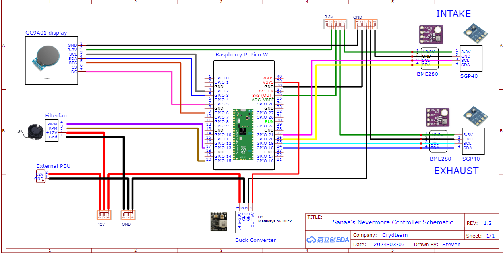
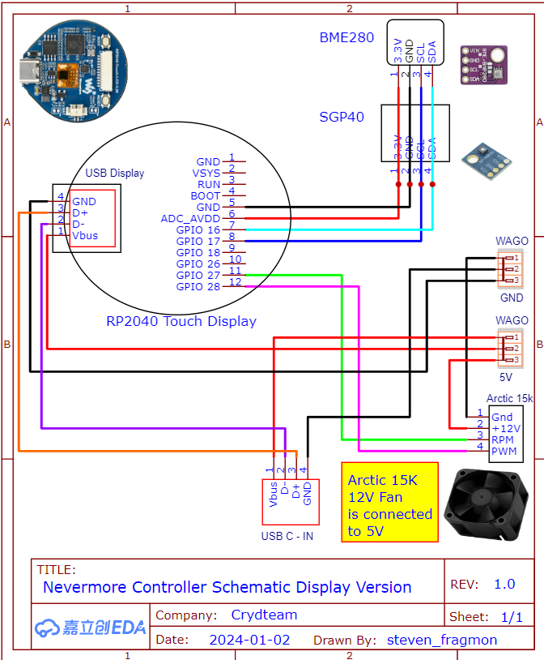

= Frustrated Parakeet's Illustrated Guide to Snarls of Wiring
:toc: macro
:toclevels: 2

https://www.buymeacoffee.com/sanaahamel[image:https://img.shields.io/badge/Support%20This%20Project%20-Buy%20me%20a%20coffee-purple.svg?style=flat-square[Support This Project - Buy me a coffee]] https://discord.gg/hWJWkc9HA7[image:https://img.shields.io/discord/1017933489779245137?color=%235865F2&label=discord&logo=discord&logoColor=white&style=flat-square[Discord]]

A guide for building attractive wire nests that'll impress anyone, guaranteed.

These guides should *not* be considered authoritative: if ever in doubt, refer to the BOM/build guide for your filter and the pins list in the main documentation.

toc::[]

== Gotchas & General Notes (READ ME DAMN IT)

* **You might not need everything you see.**
+
These guides often include optional components.

* **Some features/hardware might not be shown.**
+
These guides are not necessarily complete/exhaustive.

* **Wagos are shown for clarity but you might have to splice/solder wires instead.**
+
Consider them optional, depending on your budget and filter. (e.g. Wagos might not fit in the space available.) You just need to ensure those wires are on the same circuit.

* **Use 3.3v to power your sensors instead of 5v when possible.**
** All footnote:[Almost all?] sensor boards can handle 3.3v. This is not true for 5v.
** If you screw up your wiring (e.g. swap V~in~ with SCL or SDA), you're less likely to fry your device. Avoid doing that.

* **Voltage converters can usually be avoided.**
+
Most aftermarket printer boards can serve as an external PSU providing both 12v and 5v: 12v, 0v from an always-on fan port, and 5v from any Pi power, probe pin, etc.
+
NOTE: If you're using a lot of 12v equipment (e.g. hotend and bed), double check that you're not overloading the 12v rail. This is quite unlikely, but best be safe.

* **Power the Pico/RP2040 using `VSYS`, not `VBUS`.**
+
Powering using the `VBUS` pin will cause the controller to think it is connected via USB, and will cause it to wait while for a serial port connection during startup. This isn't a fatal mistake but it is trivial to avoid.

== General / Nevermore StealthMax (S) - Pico W

**Author: Fragmon (Steven, Crydteam)**

This diagram is illustrates a Pico W setup w/ nearly all features enabled. This would typically be seen in a https://github.com/nevermore3d/StealthMax[Nevermore StealthMax (S)] filter, though the display is not a standard feature and would require either a custom cap (search the Discord) or be mounted outside the filter.

.https://github.com/nevermore3d/StealthMax[Nevermore StealthMax (S)] Wiring Diagram

== https://github.com/nevermore3d/Nevermore_Mini[Nevermore Mini] - https://www.waveshare.com/product/rp2040-touch-lcd-1.28.htm[Waveshare Touch 1.28"]

**Author: Fragmon (Steven, Crydteam)**

This diagram is intended for a setup where the filter is powered by a USB port in the base of the filter.

NOTE: The fan listed in the diagram is rated for 12v but can operate at 5v.

WARNING: The general release UF2 **cannot** be used with this board because it is not a Pico W. There are custom builds floating on the discord. Consider this a beta/early release.

.https://github.com/nevermore3d/Nevermore_Mini[Nevermore Mini] - Waveshare Touch 1.28" Wiring Diagram

